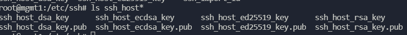
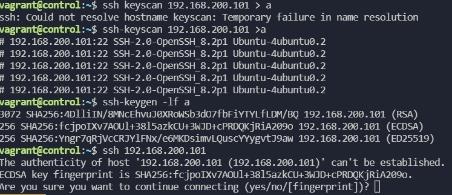
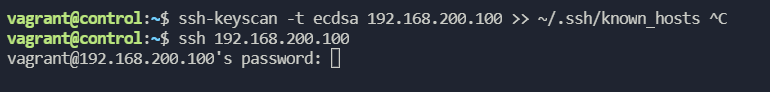
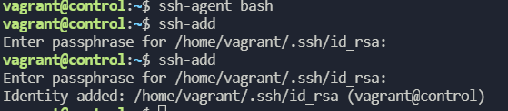

# ssh 관련   
[ssh,sudo관련 질문 링크](https://github.com/HEONPOLI/Ansible-lecture-note/blob/master/%EA%B0%95%EC%9D%98%EB%85%B8%ED%8A%B8/SSH%EB%B0%8Fsudo%20%EA%B4%80%EB%A0%A8.md)

* 기본설정   
  vagrant   
  control 192.168.200.100   
  mgmt1 192.168.200.101
  mgmt2 192.168.200.102    
  가상머신 3개 구축
```

vi /etc/ssh/sshd_config # password 로 ssh접속 허용수정
PasswordAuthentication yes 

ssh 192.168.200.101
ssh 192.168.200.102 # vagrant 로 접속되어있는 상태이기 때문에 vagrant로 원격접속된다. 
```
위의 설정을 통해 control과 mgmt 사이에 키교환없이 **패스워드**로 ssh 접속 가능        

Ansible 은 원격 시스템(SSH)을 이용하여 구성관리 해주는 도구이다. configuration management(CM), CM tool 이다.          

서버의 공개키가 클라이언트로 보내지고 그것이 ~/.ssh/known_hosts 파일에 저장.   
다음 원격접속시 해당파일을 참고하여 서버에 접속한다. 서버의 공개키가 존재하면 fingerprint 물어보는 경고문 뜨지 않는다.     

서버를 없애고 다시 생성하더라도 client에는 공개키가 남아있기 때문에 다시 접속을 시도하면 키가 맞지않는다고 한다. 해결법은 후술한다.

\
서버의 키 쌍은 /etc/ssh 파일에 존재한다. 


서버의 공개키가 클라이언트에게 전송되는것이다. Hash값을 생성한것이 fingerprint         
```
ssh-keygen -l -f ssh-host_ecdsa_key.pub # 공개키의 지문(fingerprint)을 확인가능
```
```
ssh-keyscan 192.168.200.101 # 접속하려는 서버의 키값을 알 수 있다.
```
서버로 사용하려는 가상머신을 처음 만들면 공개키의 값을 알 수 없는데 그 때 사용한다.   

```
ssh keyscan 192.168.200.101 > a
ssh-keygen -lf a
ssh 192.168.200.101 
```
         

키스캔을 통해 공개키값을 얻고 키젠을 통해 지문값을 얻고 서버로의 접속시 지문값 검증이 가능하다.
```
ssh-keyscan -t ecdsa 192.168.200.101 # 암호화방식을 지정가능
ssh-keyscan -t ecdsa 192.168.200.101 >> ~/.ssh/known_hosts #키스캔을 통해 known_hosts 파일에 직접 어펜드하고 보안의 위혐이 적은상태로 원격접속가능
```

keyscan 이용하여 known_hosts 파일에 어펜드하고 fingerprint 묻는 문장없이 접속   

**~/.ssh/known_hosts == 접속할 서버의 공개키가 저장되는 파일**    

가상머신을 지우거나 했을 때 공개키가 교체된다. knowwn_hosts 파일의 값과 달라 ssh 접속이 되지 않을 것이다.
```
rm ~/.ssh/known_hosts # 파일을 제거하거나 
ssh-keygen -f "/home/vagrant/.ssh/known_hosts" -R "192.168.200.101" # 해당 서버의 공개키만 선별적으로 삭제 할 수 있다.
```

/etc/ssh/ssh_config # client 용 파일       
/etc/ssh/sshd_config # server 용 파일         

---

```
ssh-copy-id 192.168.200.101 # 공개키를 서버쪽으로 등록시키는 것
# ~/.ssh/authorized_keys 파일에 등록된다. 
```

만약 기본경로가 아닌 파일을 생성한다면
```
ssh -i [파일경로와이름] 192.168.200.101 # 이런식으로 접속해야함
```
ssh-keygen 하면 ssh의 기본경로 ~/.ssh/id_rsa 혹은 ~/.ssh/id_rsa.pub 여기에 저장됨 이것을 읽어서 ssh 접속하는데 파일경로 다른곳으로 바뀌면 명시해줘야함

---
ssh -i .ssh/id_rsa ec2-user@머시기
cat .ssh/authorized_keys
ssh-keyscan

AWS 키페어를 가상머신 control 의 id_rsa.pub 파일을 복사붙여넣기 해서 만들고 그 키파일로 인스턴스를 만들면..   
control 안에서 인스턴스로 접속가능하다.ssh -i .ssh/id_rsa ec2-user@머시기 요러케   
ec2 instance의 cloude-init이라는 서비스를 통해 작동되는것

gcp도 마찬가지고 진행하여 VM instance 생성이 가능하다


---

## passphrase 설정 후 접속시마다 물어보지않게 하는 방법        

agent에 passphrase를 등록시켜 대신 입력시키는 방법이 있다.
```
eval "$(ssh-agent -s)"
ssh-add ~/.ssh/id_rsa
```
혹은
```
ssh-agent bash #bash 쉘을 ssh-agent 로 사용하겠다
ssh-add ~/.ssh/id_rsa
```
reboot하면 bash쉘이 재실행되므로 다시 passphrase를 물어본다. 
ls 같은 명령어를 agent 에 등록할 수 있긴하지만, 실행되고 바로 종료되므로   
bash 와 같은 쉘을 에이전트로 등록하는 것이 일반적이다.   




# 구성!
devops 유저가 키기반 인증, passphrase 사용 passwordless sudo 를 갖도록
가상머신의 
```
adduser devops # 유저생성
sudo visudo # devops  ALL=NOPASSWD: ALL sudo 권한부여
혹은
sudo visudo -f /etc/sudoers.d/devops # 파일을 만들어 권한부여도 가능하다.
ssh-keygen # passphrase 포함 키생성
# 가상머신마다 설정
ssh-copy-id devops@192.158.200.10X # 접속하려는 서버쪽으로 공개키 전송

sudo -i -u devops # devops 사용자로 전환
devops@100=> devops@101, devops@102
devops@101=> devops@100, devops@102
devops@102=> devops@100, devops@101

컨트롤에서 매니지 쪽으로만 설정
control(vagrant) => ssh-copy-id 를 devops@101,devops@102 쪽으로 
```