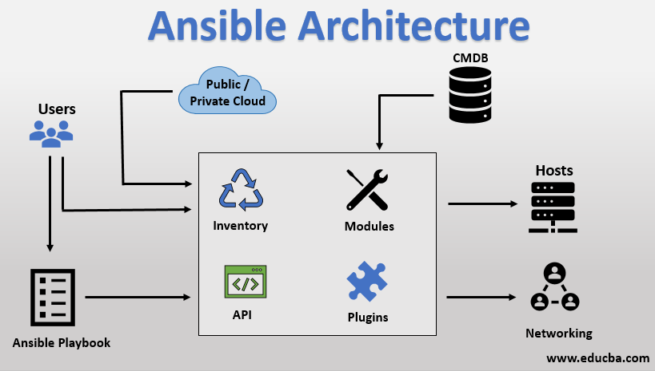

# Ansible
설치
```
sudo apt update
sudo apt install -y software-properties-common
sudo apt-add-repository -y -u ppa:ansible/ansible
sudo apt install -y ansible

#쉘 자동완성
sudo apt install -y python3-argcomplete
sudo activate-gloval-python-argcomplete3

#문법 체크
sudo apt install -y ansibel-lint
exec bash
```
IaC(Infrastructure as Code) 인프라 정의 파일을 통해 인프라의 구성관리 및 배포를 자동화하는 것.

가변인프라에 초점 -> 앤서블   
불변인프라에 초점 -> 테라폼

절차적 -> 앤서블   
선언적 -> 테라폼

마스터X 에이전트X -> 앤서블, 테라폼    

---
**Ansible 이란?**

애플리케이션 및 it인프라를 자동화 할 수 있는 도구.

1) 제어노드       
Ansible이 설치된 모든 호스트, 제어노드에서 ansible 또는 ansible-playbook 명령을 통해 작업가능하다. 모두 앤서블을 실행가능하지만, 호스트로 윈도우를 사용할 수 없다.
2) 관리노드   
Ansible로 관리하는 호스트 및 네트워크 장치
3) 인벤토리     
관리노드를 인벤토리라는 형태로 관리하게된다. 관리노드의 목록을 갖는다. 
4) 플러그인     
Ansible 핵심기능 확장할 수 있는 플러그인 제공.
5) 모듈    
모듈은 Ansible을 실행하는 Python 코드이다.    
[ansible moudules list](https://docs.ansible.com/ansible/2.9/modules/modules_by_category.html)            
6) 작업       
ansible의 실행단위, 하나의 모듈=하나의 작업
7) ad-hoc 명령       
단일작업 실행가능
8) 플레이     
플레이는 특정 관리 노드를 대상으로한 순서가 지정된 작업목록.
9) 플레이북      
하나 이상의 플레이를 갖고있는 YAML파일, ansible-playbook 명령어로 실행 

**Ansible 아키텍쳐**

* 앤서블 실행 2가지 방법    
ad-hoc: ansible       
playbook 작성: ansible-playbook   

---
**Ansible 구성**     

         
인벤토리 위치 지정

   

인벤토리에서 관리노드 ip지정     

```
ansible-doc [module name] # 모듈의 설명 볼 수 있음
```
```
ansible -m ping -a 'data=pong' mgmt
```
     

위와같이 ping에대한 모듈로 -a 로 arguement 그리고 그룹은 위에서 구성한 mgmt pong을 반환받는다.    
```
ansible-doc apt # 파라미터나 argrument를 확인하고 ad-hoc 명령해준다
ansible -m apt -a 'name=apache2 state=present' 192.168.200.101 -b
#state=absent 하면 패키지 제거된다
```
-b 옵션은 --become 으로 root 권한을 관리노드에서 사용할 수 있게끔 해준다.    

[kubespray 분석과제](https://github.com/kubernetes-sigs/kubespray)

# 3. Ansible 기본
## 3.1 인벤토리
기본 인벤토리 파일 ==> /etc/ansible/hosts    
**ansible -i 옵션**으로 다른 위치의 인벤토리 파일 지정 가능하다    
1) 정적 인벤토리       
클라우드와 다르게 고정적인 환경에서는 정적인벤토리를 쓰는게 쉽고 유연할 수 있다.    
INI, YAML 형식으로 지정, 보통 ini 사용   
      
```
ansible --lists-hosts -i a.ini [그룹이나 도메인] # 매칭된것 확인 가능
```
2) 동적 인벤토리   
플러그인 방식, 스크립트 방식 두가지가 있다.    
인벤토리 스크립트보다 인벤토리 플러그인 사용을 권장한다.   

```
vi test_aws_ec2.yaml
ansible-inventory -i test_aws_ec2.yaml --graph # 인벤토리 플러그인 테스트
```
\
위와같이 YAML파일 작성해준다.
\
인벤토리 타입의 플로그인을 확인한다. 인벤토리 구성 파일명의 끝을 반드시 머머_aws_ec2.yaml 이렇게 해줘야한다.   

      

액세스 키 아이디와 비밀키 모두 정상적으로 입력했다면 인스턴스를 동적으로 가져온다. 나의 경우 루트계정의 액세스키, 비밀키를 생성하여 입력했으므로 루트에서 인스턴스가 만들어지면 호스트가 자동으로 등록됨을 예상할 수 있다. 
```
ansible-inventory -i 정적.ini -i 동적.yaml --graph # 이런식으로 정적 동적 섞어서도 호스트 확인이 가능하다. 
ansible-inventory -i hosts/ --graph # 디렉토리를 대상으로 인벤토리 확인가능
```
---
## 3.2 구성파일
기본 구성파일의 위치는 /etc/ansible/ansible.cfg     
구성파일 우선순위        
1. ANSIBLE_CONFIG 환경변수 , # export ANSIBLE_CONFIG=/tmp/ansible.cfg   이런식으로 지정 
2. 현재 디렉토리의 ansible.cfg
3. 홈 디렉토리의 ~/.ansible.cfg
4. /etc/ansible/ansible.cfg

        

vi ~/.ansible.cfg 로 위와같이 수정하여 디폴트 인벤토리를 ~/hosts 로 지정   
---
## 3.3 관리노드 연결 
ssh 이전에 이미 설정함(키기반)

---
## Ansible ad-hoc으로 워드프레스, 디비구성

192.168.200.102 => mysql-server       
192.168.200.101 => wordpress 구성        
구성 상세정보는     
```
ansible-doc mysql_db
ansible-doc mysql_user
```

\
mysql-server 구성(192.168.200.102)
```
ansible -m apt -a 'name=python3-pymysql' 192.168.200.102 -b # ansible 모듈 mysql_user 와 mysql_db 를 위한 Requirements 이다. 

ansible -m mysql_user -a "check_implicit_admin=yes login_unix_socket=/var/run/mysqld/mysqld.sock login_user=root login_password='' name=root password='wordpress'" 192.168.200.102 -b 
# 초기에 접근할 때는 **무조건 소켓** 으로 데몬에 접근해야하기 때문에 login_unix_socket 파라미터를 yes로 해준다. 소켓파일로 접근하면 인증을 하지 않아도 된다. 따라서 login_user login_passwd 필요없음. 

ansible -m mysql_user -a "login_user=root login_password='wordpress' name=wordpress password='wordpress' host=192.168.200.0/24 priv=wordpress.*:ALL,GRANT" 192.168.200.102 -b # host는 접근할 호스트를 설정

ansible -m mysql_db -a "login_user=root login_password='wordpress' name=wordpress" 192.168.200.102 -b
```
**워드프레스를 위한 mysql 서버의 구성이 완료되면        
/etc/mysql/mysql.conf.d/mysqld.cnf 파일의 bind-address 부분을 각주처리 해준다.** 

\
wordpress 구축 (192.168.200.101)
```
# 워드프레스 관련 패키지설치 
ansible -m apt -a 'name=apache2' 192.168.200.101 -b
ansible -m apt -a 'name=php' 192.168.200.101 -b
ansible -m apt -a 'name=php-mysql' 192.168.200.101 -b
ansible -m apt -a 'name=php-gd' 192.168.200.101 -b
ansible -m apt -a 'name=php-mbstring' 192.168.200.101 -b

ansible -m get_url -a 'url=https://ko.wordpress.org/wordpress-4.8.2-ko_KR.zip dest=/home/devops/wordpress-4.8.2-ko_KR.zip' 192.168.200.101 -b

ansible -m apt -a 'name=unzip' 192.168.200.101 -b

ansible -a 'unzip /home/devops/wordpress-4.8.2-ko_KR.zip -d /var/www/html/' 192.168.200.101 -b

ansible -m service -a 'name=apache2 state=restarted' 192.168.200.101 -b

#wp-config.php 파일을 미리 수정한다. 
ansible -m copy -a "src=/var/www/html/wordpress/wp-config-sample.php dest=/var/www/html/wordpress/wp-config.php remote_src=yes" -b

ansible -m replace -a "path=/var/www/html/wordpress/wp-config.php regexp=database_name_here replace=wordpress" 192.168.200.101 -b

ansible -m replace -a "dest=/var/www/html/wordpress/wp-config.php regexp=username_here replace=wordpress" 192.168.200.101 -b

ansible -m replace -a "dest=/var/www/html/wordpress/wp-config.php regexp=password_here replace=wordpress" 192.168.200.101 -b

ansible -m replace -a "dest=/var/www/html/wordpress/wp-config.php regexp=localhost replace=192.168.200.102" 192.168.200.101 -b

```
