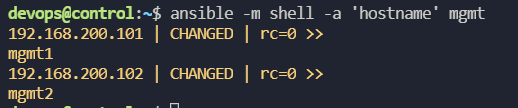
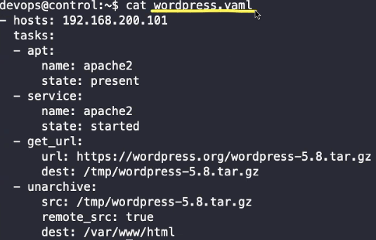

# 자주사용되는 모듈
**멱등성(idempotent)**        
여러번 연산을 하여도 결과가 달라지지 않는 성질
```
ansible -m apt -a 'name=apache2 state=present' -b 192.168.200.101
```
위와같이 같은 작업 반복하더라도 첫번째만 변경되고 그 뒤로 변경 되자않는 성질   

    

hostname 명령어를 통해서는 시스템이 변경되지 않는데 왜 CHANGED를 반환하는가?   
--> shell 모듈이 멱등성을 제공하지 않는다. 시스템에 실제 변경사항이 없더라도 멱등성을 제공하지 않는 모듈들은 command, shell,raw 등이 있다.


|명령형 모듈|python환경|Shell환경|
|----|---------|---------|
|command| O | X|
|raw|X|X|
|script|스트립트 실행| 실행
|shell|O|O|           
<br>
<br>

**명령모둘,파일모듈**
1. command     

    command는 python 환경에서 실행이므로, shell의 기능들이 적용X
```
ansible -m command -a 'id' mgmt 
```
2. raw

    원격에 python이 없어도 실행가능, 쓸일 없음
```
ansible -m raw -a 'hostname' mgmt
```
3. script
```
ansible -m script -a 'hello.sh' mgmt # 이미 있는 스크립트 실행가능
```
4. shell
```
ansible -m shell -a 'ls -l >> a.txt' mgmt # 쉘의 기능 사용가능
```
5. copy
```
ansible -m copy -a 'src=hello.sh dest=/home/devops/hi.sh mode=550' 192.168.200.101 # local의 파일을 원격으로 전송
```
6. fetch
```
ansible -m fetch -a 'src=/home/devops/hi.sh dest=/home/devops' 192.168.200.101 # 경로에 192.168.200.101 디렉토리가 생기고 192.168.200.101/home/devops/hi.sh 로 가져오기한다.
```
7. file
```
ansible -m file -a 'path=/home/devops/hi.sh state=file' 192.168.200.101 # hi.sh가 file인가를 묻는것
ansible -m file -a 'path=/home/devops/abc state=touch' 192.168.200.101 #없으면 파일 생성
ansible -m file -a 'path=/home/devops/xyz state=directory' 192.168.200.101 # 디렉토리 없으면 생성
```
**네트워크 도구 모듈**
1. get_url
```
ansible -m get_url -a 'url="https://머시기" dest=/home/devops/' 192.168.200.101
```
2. uri
```
ansible -m uri -a 'url=http://example.com' 192.168.200.101
```
**패키지 모듈**
1. apt
2. yum
3. package: os에 상관없이 auto detect 하여 설치진행

**서비스 모듈**
1. service


---
# playbook
<br>    

yaml 파일 전체를 플레이북, 파일 내용을 플레이, 하나의 플레이에는 하나 이상의 task가 있다.

task 에는 작업 순서를 꼭 지켜야한다. 절차적 언어이기 때문이다.    
```
ansible-playbook wordpress.yaml --synatax-check # 검증, 구문체크
```

```
ansible-playbook wordpress.yaml --check # 실제 시스템에 변경사항 적용하지 않고 모의로 돌려본다, skipping 상태는 시뮬레이션 할 수 없음을 나타낸다. 체크모드에서 오류가 나더라도 플레이북 실행될 수 있다. 
```

```
ansible-playbook wordpress.yaml --list-tasks # task의 목록을 확인
```
```
ansible-lint wordpress.yaml # 더 상세하게 구문체크
```
```
ansible-playbook wordpress.yaml # 플레이북 yaml파일 실행
```

1. wordpress 배포 플레이북
```
- name: Configure Mysql
  hosts: 192.168.200.102
  tasks:
#  - name: Install mysql-server
#    apt:
#      name: mariadb-server
  - name: Install python3-pymysql package
    apt:
      name: python3-pymysql
  - name: Mysql root user config
    mysql_user:
      check_implicit_admin: yes
      login_unix_socket: /var/run/mysqld/mysqld.sock
      login_user: root
      login_password: ''
      name: root
      password: 'wordpress'
  - name: Mysql wordpress user create
    mysql_user:
      login_user: root
      login_password: 'wordpress'
      name: wordpress
      password: 'wordpress'
      host: 192.168.200.0/24
      priv: wordpress.*:ALL,GRANT
  - name: Mysql database create
    mysql_db:
      login_user: root
      login_password: 'wordpress'
      name: wordpress
  - name: Unset bind-address
    lineinfile:
      path: /etc/mysql/mysql.conf.d/mysqld.cnf
      regexp: '^bind'
      line: ''
  - name: Unset mysqlx-bind-address
    lineinfile:
      path: /etc/mysql/mysql.conf.d/mysqld.cnf
      regexp: '^mysqlx'
      line: ''
  - name: Mysql Service Restart
    service:
      name: mysql
      state: restarted
- name: Configure wordpress service
  hosts: 192.168.200.101
  tasks:
  - name: Install Package apache2
    apt:
      name: apache2
  - name: Install Package php
    apt:
      name: php
  - name: Install Package php-mysql
    apt:
      name: php-mysql
  - name: Install Package php-gd
    apt:
      name: php-gd
  - name: Install Package php-mbstring
    apt:
      name: php-mbstring
  - name: Download wordpress
    get_url:
      url: https://ko.wordpress.org/wordpress-4.8.2-ko_KR.zip
      dest: /home/devops/wordpress-4.8.2-ko_KR.zip
  - name: Install Package Unzip
    apt:
      name: unzip
  - name: Unzip wordpress file
    command: unzip /home/devops/wordpress-4.8.2-ko_KR.zip -d /var/www/html/
  - name: Apache2 Service Restart
    service:
      name: apache2
      state: restarted
  - name: Copying config file wp-config.php
    copy:
      src: /var/www/html/wordpress/wp-config-sample.php
      dest: /var/www/html/wordpress/wp-config.php
      remote_src: yes
  - name: Replace DBname
    replace:
      path: /var/www/html/wordpress/wp-config.php
      regexp: database_name_here
      replace: wordpress
  - name: Replace DB user
    replace:
      path: /var/www/html/wordpress/wp-config.php
      regexp: username_here
      replace: wordpress
  - name: Replace Password
    replace:
      path: /var/www/html/wordpress/wp-config.php
      regexp: password_here
      replace: wordpress
  - name: Replace host
    replace:
      path: /var/www/html/wordpress/wp-config.php
      regexp: localhost
      replace: 192.168.200.102
                                                                                                                                                                                       101,1         Bot
```


1. wordpress 제거 플레이북
```
- name: Uninstall All WordPress Related File Package
  hosts: 192.168.200.101
  tasks:
  - name: Remove Directory Wordpress In html directory
    file:
      path: /var/www/html/wordpress
      state: absent
  - name: Remove WordPress Zip file
    file:
      path: /home/devops/wordpress-4.8.2-ko_KR.zip
      state: absent
  - name: Remove Package php-mbstring
    apt:
      name: php-mbstring
      state: absent
  - name: Remove Package php-gd
    apt:
      name: php-gd
      state: absent
  - name: Remove Package php-mysql
    apt:
      name: php-mysql
      state: absent
  - name: Remove Package php
    apt:
      name: php
      state: absent
  - name: Remove Package apache2
    apt:
      name: apache2
      state: absent

- name: Uninstall PyMySQL Databases Related packages
  hosts: 192.168.200.102
  tasks:
  - name: Remove Mysql wordpress user
    mysql_user:
      login_user: root
      login_password: 'wordpress'
      name: wordpress
      state: absent
  - name: Remove Mysql Databases
    mysql_db:
      name: wordpress
      login_user: root
      login_password: 'wordpress'
      state: absent
  - name: Remove Mysql root User
    mysql_user:
      name: root
      login_user: root
      login_password: wordpress
      state: absent      
  - name: Remove package python3-pymysql
    apt:
      name: python3-pymysql
      state: absent
      
```
root user를 가장 마지막에 지우는?? 
```
- name: Uninstall PyMySQL Databases Related packages
  hosts: 192.168.200.102
  tasks:
  - name: Uninstall mysql-server
    command: sudo apt autoremove -y  mysql-server
  - name: Remove file related mysql
    file:
      path: /var/lib/mysql
      state: absent
  - name: Remove file /etc/mysql
    file:
      path: /etc/mysql
      state: absent
  - name: Remove package python3-pymysql
    apt:
      name: python3-pymysql
      state: absent
```
이 방법을 적용해서 다시 작성해보자

