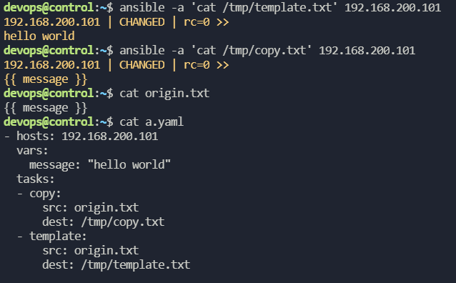

## 도커설치 shell 없이 apt_key, apt_repository 모듈 사용
[docker ansible playbook installattion 참고사이트](https://www.digitalocean.com/community/tutorials/how-to-use-ansible-to-install-and-set-up-docker-on-ubuntu-18-04)
```yaml
- name: Install Docker
  hosts: 192.168.200.101
  tasks:
  - name: Install Related Packages
    apt:
      update_cache: yes
      name: apt-transport-https, ca-certificates, curl, gnupg, lsb-release
      state: present
  - name: Get gpg key
    apt_key:
      url: https://download.docker.com/linux/ubuntu/gpg
      state: present
  - name: Add Repository
    apt_repository:
      repo: deb https://download.docker.com/linux/ubuntu bionic stable
      state: present
  - name: Install Docker-ce, Docker-ce-cli, containerd.io
    apt:
      update_cache: yes
      name: docker-ce, docker-ce-cli, containerd.io
  - name: Install Pip3
    apt:
      name: python3-pip
      state: present
  - name: Install Docker module for Python
    pip:
      name: docker
```
## 변수를 이용한 deploy wordpress+mysql

```yaml
vars 디렉토리밑에 db_vars.yaml, wp_vars.yaml 작성

###db_vars.yaml
db_var:
  socket_path: /var/run/mysqld/mysqld.sock
  db_user_root_pw: wordpress
  db_user_wp: wordpress
  db_user_wp_pw: wordpress
  db_name: wordpress
  conf_path: /etc/mysql/mysql.conf.d/mysqld.cnf

###wp_vars.yaml
wp_var:
  wp_sampleconf_php: /var/www/html/wordpress/wp-config-sample.php
  wp_conf_php: /var/www/html/wordpress/wp-config.php
```
계층 구조로 만든 변수파일을 참조할 때 방법은 두가지가 있다.    
```yaml
- name: Configure Mysql
  hosts: 192.168.200.102
  vars_files:
    - vars/db_vars.yaml
## 위와같이 vars_files 를 통해 만든 yaml 파일을 변수그룹으로 지정할 수 있다.   
## wordpress 를 배포할 yaml 과 같은 디렉토리 밑에 vars 디렉토리를 만들어놓고 참조하였다. 

login_unix_socket: "{{ db_var['socket_path'] }}" # 대괄호 표기법
login_unix_socket: "{{ db_var.socket_path }}" # 점 표기법
```
점 표기법은 일부키가 python dict 속성 및 메서드와 충돌할 수 있어서 대괄호 표기법을 권장한다.   


---
## template
           
템플릿 모듈을 사용하면 변수의 값이 파일에 들어갈 수 있게 할 수 있다.


{{ ansible_managed | comment }} 추가로 직접수정방지 문구를 고지할 수 있다. 

wp-config.php 를 template으로 구현해보기
replace를 걷어내고 template 모듈로..

```bash
wp+mysql 밑에
mkdir jinja
wordpress wp-config-sample.php 를 따와서 진행
wp.j2 이렇게 파일을 옮겨주고 그대로 고치는듯;
control 에서의 jinja 파일을 src로 dest는 /var/www/html/wordpress/wp-config.php 로 


/** The name of the database for WordPress */
define( 'DB_NAME', '{{ db.database }}' );

/** MySQL database username */
define( 'DB_USER', '{{ db.user }}' );

/** MySQL database password */
define( 'DB_PASSWORD', '{{ db.password }}' );

devops@control:~/wp/jinja$ ansible -m template -a 'src=wp-config.php.j2 dest=/tmp/wp-config.php' -e @../vars/deploy_vars.yaml 192.168.200.100

- name: Copy & Setting wp-config.php DB configuration
    template:
      src: jinja/wp-config.php.j2
      dest: /var/www/html/wordpress/wp-config.php

```

## 변수를 통해서 원하는 포트 지정
/etc/apache2/ports.conf 에 서비스 포트를 변수로 정의 변수를 사용하는 템플릿 이용해서 배포
```bash
### jinja 밑에 ports.j2 템플릿을 생성해준다.
###pots.conf 서비스 서버에서 가져와서 변수만 작성
# If you just change the port or add more ports here, you will likely also
# have to change the VirtualHost statement in
# /etc/apache2/sites-enabled/000-default.conf

Listen "{{ port_var.service_port }}"

<IfModule ssl_module>
        Listen 443
</IfModule>

<IfModule mod_gnutls.c>
        Listen 443
</IfModule>

# vim: syntax=apache ts=4 sw=4 sts=4 sr noet
```
변수도 지정한것 var/wp_vars.yaml 에 추가해준다.
        
배포하는 yaml 파일에는 아래와같이 추가해준다.
```yaml
  - name: Change Service port
    template:
      src: jinja/ports.j2
      dest: /etc/apache2/ports.conf
      force: yes
  - name: Service restart apache2
    service:
      name: apache2
      state: restarted 
```
내가 아파치 서비스를 restarted 를 state로 지정해줬는데 리스타트는 멱등성(idempotent)를 제공해주지 못하므로, reloaded 를 하는 것이 좋다.

## Handler       
ansible에서 멱등성을 제공하는 핵심        
시스템의 변경사항(설정파일 변경같은..)이 있을 때만 작업을 호출한다.      
호출되는 작업을 '핸들러' 라고 한다.        

**작업과 핸들러의 실행순서**        
변경사항이 수신되어도 즉시 실행하는 것이 아니라 태스크가 모두 종료되고 핸들러가 실행된다
```yaml
  - name: Change Service port
    template:
      src: jinja/ports.j2
      dest: /etc/apache2/ports.conf
      force: yes
    notify:
    - Restart apache2
  handlers:
    - name: Restart apache2
      service:
        name: apache2
        state: restarted
```
위와같이 포트 변경의 서비스 제공변화가 있을 때 notify의 이름을 통해 handler 이름을 따서 지정, handler가 실행되게끔 하는것   
