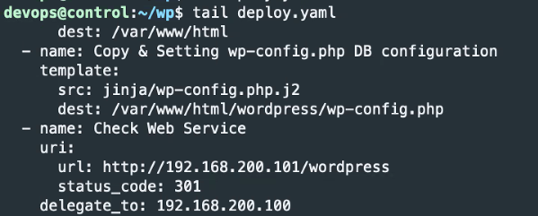
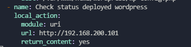
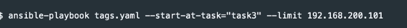

# ansible 작업제어 ansible playbook keywords

## 반복문
```yaml
- hosts: 192.168.200.101
  tasks:
  - debug:
      msg: "{{ item }}"
    loop:
    - a
    - b
    - c
```
```yaml
- hosts: 192.168.200.101
  tasks:
  - debug:
      msg: "{{ item.user }} - {{ item.group }}"
    loop:
    - user: u1
      group: g1
    - user: u2
      group: g2
```
```yaml
- hosts: 192.168.200.101
  vars:
    users:
    - user1
    - user2
    - user3
    dbs:
    - db1
    - db2
    - db3

  tasks:
  - debug:
      msg: "{{ item[0] }} - {{ item[1] }}"
    loop:
    - "{{ users | product( dbs ) | list }}"
```
## 조건문
ansible_facts['os_family'] == "Debian" 이런식으로 Redhat 계열과 Debian 계열을 조건문으로 나눠서 Centos 와 Ubuntu에 맞게 Wordpress 설치 진행해줄 수 있다. Fact 변수를 사용하므로 gather_facts 는 yes 혹은 모듈을 사용하지 않는 default 로 사용한다.    

조건문 형식
```yaml
-debug:
  msg: hello world
 when: variable is test_name
 ```
 is 라는 조건을 통해 true와 false값을 반환한다 

 이외에 directory, file, link, exists, same_file 등 여러 테스트 가능하다

 등록변수 register를 사용하면 이전 작업의 결과를 테스트해볼 수 있다.
 ```yaml
 tasks:
  - shell: /usr/bin/foo
    register: result
    ignore_errors: True
  - debug:
      msg: "it failed"
    when: result is faild
```


## 위임
특정작업을 다른 host 에서 플레이한다     
delegete_to 키워드 사용       
delegate_to: localhost ==> local_action 모듈과 같은 의미       

배포된 wordpress를 local(192.168.200.100)에서 uri 모듈로 확인하는 것 




## 블록
```yaml
- hosts: 192.168.200.101
  tasks:
  - name: block1
    block:
    - name: block - task1
      debug:
        msg: hello world
    - name: block - task2
      command: ls -w
    - name: block - task3
      debug:
        msg: after failuer
    rescue:
    - name: rescue - task1
      debug:
        msg: rescue block
    - name: rescue - task2
      command: ls -w
    - name: rescue - task3
      debug:
        msg: after fauluer
    always:
    - name: always - task1
      debug:
        msg: always run
```
## 작업 오류처리
ignore_errors 키워드 : 작업실패해도 넘어간다.        
any_errors_fatal 키워드를 true로 해놓으면 작업실패시 모든 호스트의 작업이 중단된다. 

## 전략
ansible에서는 기본적으로 하나의 작업을 동시에 5개의 호스트에서까지 가능하다.    **태스크** 하나를 5개의 호스트에서 먼저 처리 나머지 호스트에서 처리하고 그 다음 태스크로 넘어갈 수 있는 것 

serial --> 플레이를 실행해야하는 **호스트**의 수를 제한할 수 있다. 만약 serial 값이1 이면 하나의 호스트에서 모두 태스크를 처리하고 다음 호스트로 넘어가는것. 한 플레이 전체를 몇대의 호스트가 처리할거냐는 것      


serial 이 1이므로 호스트 한개에서 태스크 처리를 모두하라, fork 1이므로 작업을 1개단위로 진행, 호스트1에서 한개단위의 작업이 모두 끝나면 호스트 2로 넘어가는 것 


## 동기화
```
- hosts: 192.168.200.101
  tasks:
  - name: long task
    command: sleep 100
    async: 120
    poll: 0
    register: comm_result

  - name: 2nd task
    debug:
      msg: "hello world"

  - name: 3rd task
    debug:
      msg: "{{ comm_result }}"

  - name: sync
    async_status:
      jid: "{{ comm_result.ansible_job_id }}"
    register: job_result
    until: job_result.finished
    retries: 100
    delay: 5

  - name: 4th task
    debug:
      msg: "{{ job_result }}"
```
poll 0값으로 비동기 백그라운드 방식으로 long task 를 돌려놓고 나머지 작업 수행후 동기화 작업 수행해준다. finished 값이 1이 될 때까지 sync task를 수행하고 동기화인 그 작업이 끝나면 4번째 task로 넘어가게된다.     

## 태그

## 작업 시작 및 단계
task를 시작할 곳을 정할 수 있고 host또한 정할 수 있다. 
       


## 배운 내용을 토대로 wordpress 배포 재정의
1. Web(Wordpress), DB 플레이 분리
2. 아파치 포트 변경
    /etc/apache/ports.conf
    handlers
3. Debian 계열 및 RedHat 계열 작업 분리
    조건문 사용
4. wordpress 소스 다운로드 비동기 방식 설정       
wordpress 를 맨처음에 다운로드 받아놓고 내꺼 기준이면 unzip 하기 직전에 동기화 확인하고 unzip 해주는 걸로 하면 될 것 같다. 
5. 블록
6. 위임 : 접근 테스트할 때 100번에서 101번 uri로 확인하기

```yaml
- name: Configure Mysql
  hosts: 192.168.200.102
  vars_files:
    - vars/db_vars.yaml
  tasks:
    - name: Install, configure and running DataBase Debian
      block:
        - name: Install pymysql mysql-server package Debian
          apt:
            name: python3-pymysql, mysql-server
            state: present
        - name: Mysql root user config
          mysql_user:
            check_implicit_admin: yes
            login_unix_socket: "{{ db_var['socket_path'] }}"
            login_user: root
            login_password: ''
            name: root
            password: "{{ db_var['db_user_root_pw'] }}"
        - name: Mysql wordpress user create
          mysql_user:
            login_user: root
            login_password: "{{ db_var['db_user_root_pw'] }}"
            name: "{{ db_var['db_user_wp'] }}"
            password: "{{ db_var['db_user_wp_pw'] }}"
            host: 192.168.200.0/24
            priv: "{{ db_var['db_user_wp'] }}.*:ALL,GRANT"
        - name: Mysql database create
          mysql_db:
            login_user: root
            login_password: "{{ db_var['db_user_root_pw'] }}"
            name: "{{ db_var['db_name'] }}"
        - name: Unset bind-address
          lineinfile:
            path: "{{ db_var['conf_path'] }}"
            regexp: '^bind'
            line: ''
        - name: Unset mysqlx-bind-address
          lineinfile:
            path: "{{ db_var['conf_path'] }}"
            regexp: '^mysqlx'
            line: ''
        - name: Mysql Service Restart
          service:
            name: mysql
            state: restarted
      when: ansible_facts['os_family'] == "Debian"
    - name: Install, configure and running DataBase RedHat
      block:
        - name: Install pymysql mysql-server package Redhat
          yum:
            name: python3-pymysql, mysql-server
            state: present
        - name: Mysql root user config
          mysql_user:
            check_implicit_admin: yes
            login_unix_socket: "{{ db_var['socket_path_Redhat'] }}"
            login_user: root
            login_password: ''
            name: root
            password: "{{ db_var['db_user_root_pw'] }}"
        - name: Mysql wordpress user create
          mysql_user:
            login_user: root
            login_password: "{{ db_var['db_user_root_pw'] }}"
            name: "{{ db_var['db_user_wp'] }}"
            password: "{{ db_var['db_user_wp_pw'] }}"
            host: 192.168.200.0/24
            priv: "{{ db_var['db_user_wp'] }}.*:ALL,GRANT"
        - name: Mysql database create
          mysql_db:
            login_user: root
            login_password: "{{ db_var['db_user_root_pw'] }}"
            name: "{{ db_var['db_name'] }}"
        - name: Mysql Service Restart
          service:
            name: mysqld
            state: restarted
      when: ansible_facts['os_family'] == "RedHat"
- name: Configure wordpress service
  hosts: 192.168.200.101
  vars_files:
    - vars/wp_vars.yaml
  tasks:
  - name: Download wordpress
    get_url:
      url: https://ko.wordpress.org/wordpress-4.8.2-ko_KR.zip
      dest: /home/devops/wordpress-4.8.2-ko_KR.zip
    async: 120
    poll: 0
    register: down_result
  - name: Install Package apache2
    apt:
      name: apache2
    when: ansible_facts['os_family'] == "Debian"
  - name: Install Package httpd
    yum:
      name: httpd
    when: ansible_facts['os_family'] == "RedHat"
  - name: Install Package php debian
    apt:
      name: php, php-mysql, php-gd, php-mbstring, unzip
    when: ansible_facts['os_family'] == "Debian"
  - name: Install Package php redhat
    yum:
      name: php, php-mysql, php-gd, php-mbstring, unzip
    when: ansible_facts['os_family'] == "RedHat"
  - name: sync
    async_status:
      jid: "{{ down_result.ansible_job_id }}"
    register: job_result
    until: job_result.finished
    retries: 100
    delay: 5
  - name: Unzip wordpress file
    command: unzip /home/devops/wordpress-4.8.2-ko_KR.zip -d /var/www/html/
  - name: Copy & Setting wp-config.ph with template
    template:
      src: jinja/wp-config.php.j2
      dest: /var/www/html/wordpress/wp-config.php
  - name: Check status deployed wordpress
    local_action:
      module: uri
      url: http://192.168.200.101
      return_content: yes
  - name: Change Service port in Debian
    template:
      src: jinja/ports.j2
      dest: /etc/apache2/ports.conf
      force: yes
    notify:
    - Restart apache2
    when: ansible_facts['os_family'] == "Debian"
  - name: Change Service port in Redhat
    template:
      src: jinja/portsrh.j2
      dest: /etc/httpd/conf/httpd.conf
      force: yes
    notify:
    - Restart httpd
    when: ansible_facts['os_family'] == "RedHat"
  handlers:
    - name: Restart apache2
      service:
        name: apache2
        state: restarted
    - name: Restart httpd
      service:
        name: httpd
        state: restarted
- name: Check Web Status
  hosts: local
  tasks:
  - name: Check Web Status using uri
    uri:
      url: http://192.168.200.101:8080/wordpress
      status_code: 200
      return_content: yes
```