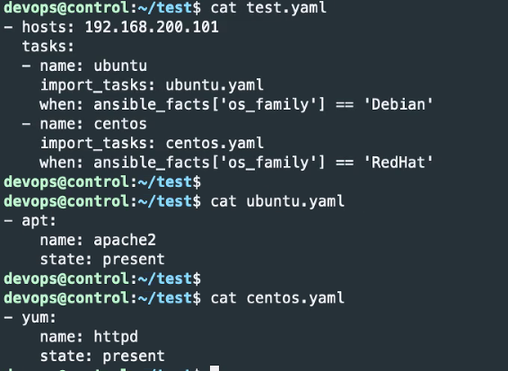
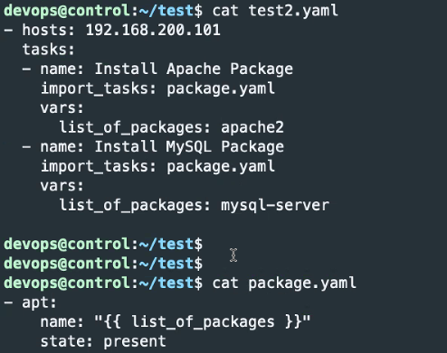
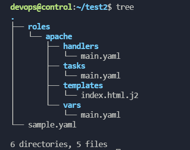
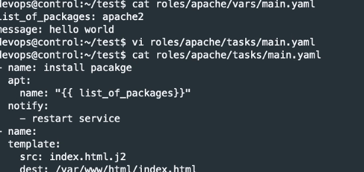
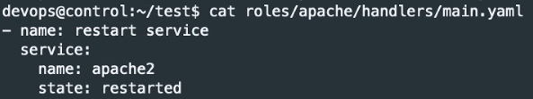

# wp

아파치 패키지 설치되고 확인해줘야한다.     ✔

bind-address 풀어주는거 템플릿 이용해서 제공해보기     ❌ -> 각주처리만 해주는 것인데 템플릿 제공하는것은 불필요하다고 생각해서 하지않음

mysql service handler로 넘겨서 재시작하기       ✔

tar로 받아오기     ✔

변수파일 리스트로 작성해서 불필요하게 변수 집어넣지 않기     ❌ -> 추후 정리

웹 체크 한번 더한거 지우기     ✔

맨 밑에 웹체크에 ip 주소나 포트번호도 변수로 설정해보기         ✔

블록 안에서 notify하고 블록 밖에서 핸들러로서 사용해도 된다.      ✔

wordpress 부분도 redhat 부분이랑 debian 부분 따로 block 처리를 해주자       ✔


# 아티팩트 재사용 
1. 변수 재사용       

include_vars 모듈을 이용하는것이 vars_files 이용하는 것보다 우선순위가 높다.   

현재 inventory는 ~/hosts 에 존재한다       
~/hosts/group_vars 에 mgmt 라는 인벤토리에 설정된 그룹이름으로 파일안에 변수설정가능       
~/hosts/host_vars 를 만들어서 호스트이름과 똑같은 파일 생성해서 변수를 작성가능하다.      

그룹이름이나 호스트이름의 파일 뿐만아니라 디렉토리를 만들어서 안에 아무이름의yaml 파일을 작성하여도 된다.     

1. 작업 재사용       

include & import         
import는 반복이 불가능, 반복문을 사용하려면 include를 사용
핸들러를 사용하거나 start task 사용할 때는 import 사용        

<br>

<br>


block 문 -> import_tasks 를 이용한 외부로 빼버린다..      

현재의 main.yaml 플레이북을 간결하게 만들어주자    

# 역할 

vars , tasks, templates , handlers
```yaml
- hosts: 192.168.200.101
  vars:
    list_of_packages: apache2
    message: hello world
  tasks:
  - name: install pacakge
    apt:
      name: "{{ list_of_packages}}"
    notify:
      - restart service
  - name:
    template:
      src: index.html.j2
      dest: /var/www/html/index.html
  handlers:
  - name: restart service
    service:
      name: apache2
      state: restarted
```
```jinja
index.html.j2
<html>
  <head>
    <title> hello world </title>
  </head>
  <body>
    {{ message }}
  </body>
</htlm>
```
위의 두 파일을 role로 정의하기      
<br><br/>


<br><br/>

      


# 암호화    
암호화 두가지      
1. 단일 vault password
```bash
ansible-vault create a.yaml # 볼트 패스워드를 물어보고 암호화할 파일을 생성
```
```bash
ansible-vault create --vault-password-file vault_pass a.yaml # 패스워드 파일을 통해서도 생성가능
```
```bash
ansible-vault edit a.yaml # 볼트 패스워드 물어보고 편집가능
```
```bash
ansible-valut rekey a.yaml # 볼트 패스워드를 재지정
```
```bash
ansible-vault encrypt a.yaml # 기존의 파일 암호화
```
```bash
ansible-vault view a.yaml # 파일편집하지 않고 내용확인
```
```bash
ansible-vault descrypt a.yaml # 복호화 진행
```
**암호화된 파일이 단일 패스워드를 사용하는 경우 playbook 실행**        
```bash
ansible-playbook --ask-vault-pass a_playbook.yaml
```
2. 다중 vault id 를 이용한 password          
암호화 대상에 vault ID 를 통해서 별도의 볼트 패스워드를 지원한다.         
단일 패스워드 지정과 같은 키워드를 사용하지만
```bash
--vault-id 유저이름@패스워드형식 
```
위와같이 제공하여야한다.       
패스워드 형식에는 파일명, 프롬프트(prompt), script파일명 이 있다.       
파일명은 단일패스워드와 같이 패스워드가 들어있는 파일이다. 프롬프트는 패스워드를 대화형으로 받는다.   

**여러 볼트패스워드를 태스크 yaml로 포함하는 playbook 실행**     
```bash
ansible-playbook --vault-id auser@prompt --vault-id buser@prompt a_b_main.yaml
```


인벤토리에서      
[webserver]
192.168.200.101       
[dbserver]
192.168.200.102      
이런식으로 정의해보기

1. Web(Wordpress), DB 플레이 분리
2. 아파치 포트 변경
    /etc/apache/ports.conf
    handlers
3. Debian 계열 및 RedHat 계열 작업 분리
    조건문 사용
4. wordpress 소스 다운로드 비동기 방식 설정
5. 블록
6. 위임
7. group_vars/host_vars 변수
8. include/import 작업 정의a
9. 역할 구성(wordpress,database)
10. ansible-vault

vault로 main.yaml 안에 a.yaml과 b.yaml을 암호화 하여 import_tasks 해서 제공해보자     