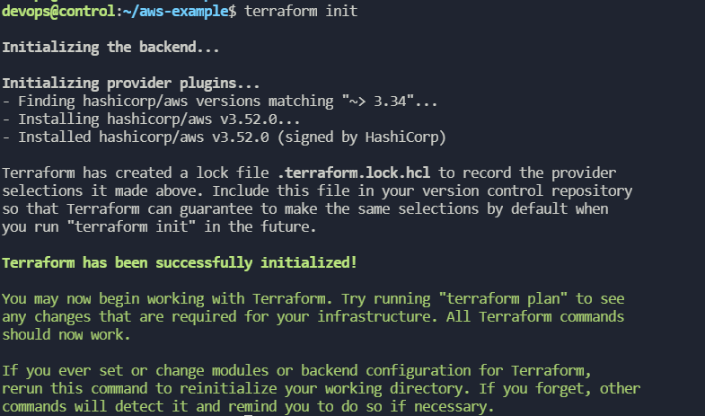
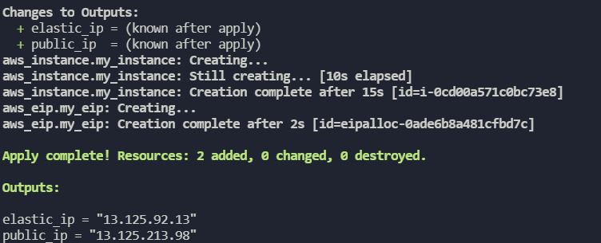

# Terraform
인프라의 자동화된 배포, 변경 및 관리를 제공        

HCL(HashCorp Configuration Language) 라는 구성파일로 작성하여 자동화된 배포를 한다.        

[AWS CLI 설치](https://docs.aws.amazon.com/ko_kr/cli/latest/userguide/install-cliv2-linux.html)             
```bash
aws configure  
액세스키, 시크릿키는 내 계정의 보안자격증명에서 생성혹은 확인하여 입력한다.    
```

[Terraform 설치 ubuntu](https://www.terraform.io/docs/cli/install/apt.html)       

```bash
curl -fsSL https://apt.releases.hashicorp.com/gpg | sudo apt-key add -

sudo apt-add-repository "deb [arch=$(dpkg --print-architecture)] https://apt.releases.hashicorp.com $(lsb_release -cs) main"

sudo apt install terraform
```
---
## terraform 으로 인스턴스 배포 예제
```bash
mkdir aws-example && cd aws-example
vi main.tf
```
```
terraform {
  required_providers {
    aws = {
      source  = "hashicorp/aws"
      version = "~> 3.34"
    }
  }
}

provider "aws" {
  profile = "default"
  region  = "ap-northeast-2"
}

resource "aws_instance" "my_instance" {
  ami           = "ami-0ec37230f5ced8b39"
  instance_type = "t3.micro"

  tags = {
    Name = "MyInstance"
  }
}
```
```bash
terraform init # 프로바이더 플러그인을 다운로드하고 설치
terraform fmt # 구성파일의 공백이나 스타일을 자동으로 재구성한다.
terrafrom validate # 구성파일의 유효성을 검증
terraform plan # 필요한 작업을 결정, 최초배포 구성변경 등에대한 계획일치 확인
```
```bash
terraform apply # 리소스를 최초배포 혹은 이미 배포된 리소스 구성변경
#yes 입력시 배포 허용
#이외의 다른 입력시 배포 차단
terraform show # 리소스 확인
```

<br><br/>

apply 하게되면 terraform.tfstate 파일이 생성되는데 이 파일을 삭제하게되면 기존에 생성된 리소스는 테라폼 관리 범위에서 벗어난다.         

```
terraform destroy # 인프라의 전체 리소스를 삭제한다. 
```

**특정 리소스만 지우는 방법**          
tf 파일의 해당 인스턴스 혹은 버켓 등의 라인을 지우고 apply 해주면 된다.     

terraform.tfstate.backup # 리소스 변경 전의 terraform 상태이다.       

---
## 리소스 종속성
provider.tf
```
terraform {
  required_providers {
    aws = {
      source  = "hashicorp/aws"
      version = "~> 3.34"
    }
  }
}

provider "aws" {
  profile = "default"
  region  = "ap-northeast-2"
}
```
Provider 정보 tf 파일을 따로 빼줬다.         
<br></br>

main.tf
```
resource "aws_instance" "my_instance_a" {
  ami           = "ami-0ec37230f5ced8b39"
  instance_type = "t3.micro"

  tags = {
    Name = "MyInstanceA"
  }
}

resource "aws_instance" "my_instance_b" {
  ami           = "ami-0ec37230f5ced8b39"
  instance_type = "t3.micro"

  tags = {
    Name = "MyInstanceB"
  }
  depends_on = [aws_s3_bucket.my_bucket] # 명시적 종속성!! s3버킷이 생성된 이후에 인스턴스생성, 리소스간에 의존성을 명확하게 정의해줄 수 있다. 
}

resource "aws_eip" "my_eip" {
  vpc      = true
  instance = aws_instance.my_instance_a.id # 암시적 종속성!! Elastic ip가 생성되기전에 인스턴스가 생성되어 있어야하므로 암시적이다. 
}

resource "aws_s3_bucket" "my_bucket" {
  acl = "private"
}
```
---
## 입력변수, 출력값 정의 
변수정의 -> .tf 확장자           
변수 값 할당 -> .tfvars 확장자로 정의         
variable.tf
```
variable "aws_region" {
  description = "AWS region"
  type        = string
  default     = "ap-northeast-1"
}

variable "ami_image" {
  description = "Ubuntu 18.04 LTS Image"
  type        = map(string)
  default = {
    ap-northeast-1 = "ami-0d4829cafe34d5d92"
    ap-northeast-2 = "ami-0ec37230f5ced8b39"
  }
}

variable "instance_type" {
  description = "EC2 instanace type"
  type        = string
  default     = "t3.micro"
}
```
main.tf
```
resource "aws_instance" "my_instance" {
  ami           = var.ami_image[var.aws_region]
  instance_type = var.instance_type

  tags = {
    Name = "MyInstance"
  }
}

resource "aws_eip" "my_eip" {
  vpc      = true
  instance = aws_instance.my_instance.id
}
```
terraform.tfvars      # tfvars를 작성안했다면 ap-northeast-1 의 default로 리전이 결정됐을것이다. 
```
aws_region = "ap-northeast-2"
```
output.tf
```
output "public_ip" {
  description = "Public IP inst"
  value       = aws_instance.my_instance.public_ip
}

output "elastic_ip" {
  description = "EIP of inst"
  value       = aws_eip.my_eip.public_ip
}
```
         
출력값을 가장 마지막에 보여주고있다.     

```
terraform output # 출력값을 확인가능하다.
```
---
## 로컬값
기존의 프로그래밍에 비교한다면          
입력변수: 함수의 인수           
출력값: 함수의 반환 값        
로컬값: 함수의 지역변수         

variable.tf 에 추가 
```
variable "project_name" {
  description = " Name of the project"
  type        = string
  default     = "my_project"
}

variable "environment" {
  description = "Name of the environment"
  type        = string
  default     = "dev"
}
```
local.tf 생성 # 3개의 값의 태그를 로컬값으로 지정
```
locals {
  common_tags = {
    Name        = "${var.project_name}-${var.environment}"
    Project     = var.project_name
    Environment = var.environment
  }
}
```
main.tf 에서 참조
```
resource "aws_instance" "my_instance" {
  ami           = var.ami_image[var.aws_region]
  instance_type = var.instance_type

  tags = local.common_tags
}
```
---
## 데이터소스 사용

data_source.tf 
```
data "aws_ami" "amazon_linux" {
  most_recent = true
  owners      = ["amazon"]

  filter {
    name   = "name"
    values = ["amzn2-ami-hvm-*-x86_64-ebs"]
  }
}
```
main.tf
```
resource "aws_instance" "my_instance" {
  ami           = data.aws_ami.amazon_linux.id
  instance_type = var.instance_type

  tags = local.common_tags
}
```
ec2에다가 인스턴스하나는 워드프레스 올리고        
rds 로 데이터베이스 사용할것 

aws_db_instance 에서 옵션 사용해야하는것 목록         
```
allocated_storage 
availability_zone 
engine 
engine_version
name    # 생성할 데이터베이스 이름
password # 마스터 rds의 패스워드임, 디비 생성된거 패스워드 아님
publicly_accessible # 공개적으로 접속 허용, 거부 boolean
username # 마스터 rds 의 user이름
endpoint
```
[참고 블로그](https://medium.com/@chiragchaudhuri02/deploy-wordpress-with-rds-backend-on-aws-using-terraform-e19d9d8a76c5)
```
#!/bin/bash
sudo -i
apt install -y apache2 php php-mysql php-gd php-mbstring wget
wget https://wordpress.org/wordpress-5.8.tar.gz
tar -xzvf wordpress-5.8.tar.gz
cp -r wordpress/* /var/www/html/
systemctl restart apache2