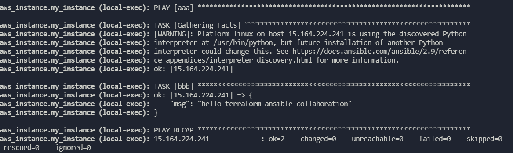
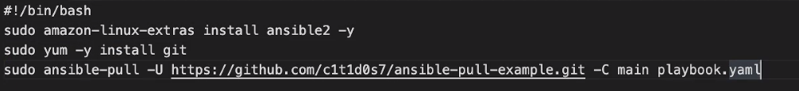
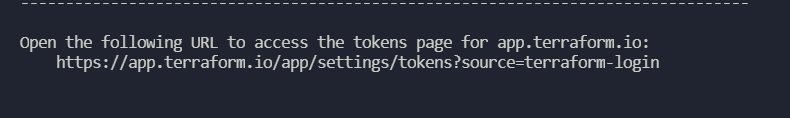

# 구성 관리 및 Provisioner
## Cloud-init
간단히 보안그룹 생성, 웹서버 배포        
security-group.tf
```
resource "aws_security_group" "my_sg_web" {
  name = "allow-web"
  egress {
    from_port   = 0
    to_port     = 0
    protocol    = "-1"
    cidr_blocks = ["0.0.0.0/0"]
  }
  ingress {
    from_port   = 80
    to_port     = 80
    protocol    = "tcp"
    cidr_blocks = ["0.0.0.0/0"]
  }
}
```
main.tf
```
resource "aws_instance" "my_instance" {
  ami                    = data.aws_ami.amazon_linux.id
  instance_type          = var.instance_type
  user_data              = file("./web_deploy.sh")
  vpc_security_group_ids = [aws_security_group.my_sg_web.id]
  tags                   = local.common_tags
}

resource "aws_eip" "my_eip" {
  vpc      = true
  instance = aws_instance.my_instance.id
}
```
web_deploy.sh
```
#!/bin/bash
sudo yum install -y httpd
sudo systemctl --now enable httpd
echo -n "<h1>Hello World</h1>" | sudo tee /var/www/html/index.html
```
elastic ip 리소스 또한 만들었으므로, eip 주소로 접속하면 확인가능하다.        

---
## 프로비저너
* 일반 프로비저너
1. file        
 파일 및 디렉토리 복사
2. local-exec          
terraform 실행되는 로컬에서 실행
3. remote-exec        
원격 인스턴스에서 실행 

* 벤더 프로비저너
1. chef     
2. habitat
3. puppet
4. salt-masterless

main.tf
```
resource "aws_instance" "my_instance" {
  ami                    = data.aws_ami.amazon_linux.id
  instance_type          = var.instance_type
  user_data              = file("./web_deploy.sh")
  vpc_security_group_ids = [aws_security_group.my_sg_web.id]
  key_name               = aws_key_pair.my_sshkey.key_name

  connection {
    type        = "ssh"
    user        = "ec2-user"
    private_key = file("./my_sshkey")
    host        = self.public_ip
  }
  provisioner "file" {
    source      = "web_deploy.sh"
    destination = "/tmp/web_deploy.sh"
  }
  provisioner "remote-exec" {
    inline = [
      "chmod +x /tmp/web_deploy.sh",
      "/tmp/web_deploy.sh",
    ]
  }
  provisioner "local-exec" {
    command = "echo ${self.public_ip} > ipaddr.txt"
  }
  tags = local.common_tags
}

resource "aws_key_pair" "my_sshkey" {
  key_name   = "my_sshkey"
  public_key = file("./my_sshkey.pub")
}


resource "aws_eip" "my_eip" {
  vpc      = true
  instance = aws_instance.my_instance.id
}
```
security-group.tf --> ssh 포트를 열어주지 않으면 인스턴스 생성이 안된다. 
```
resource "aws_security_group" "my_sg_web" {
  name = "allow-web"
  egress {
    from_port   = 0
    to_port     = 0
    protocol    = "-1"
    cidr_blocks = ["0.0.0.0/0"]
  }
  ingress {
        from_port = 22
        to_port = 22
        protocol = "tcp"
        cidr_blocks = ["0.0.0.0/0"]
        }
  ingress {
    from_port   = 80
    to_port     = 80
    protocol    = "tcp"
    cidr_blocks = ["0.0.0.0/0"]
  }
}
```
---
## Taint 테인트 
위와같이 인스턴스 같은 리스소에 문제가 있다면 tainted 처리가 자동으로 되고 테인트 상태인 리소스는 교체(재생성)된다. 

특정 리소스를 삭제하고 생성하려는 경우에 수종으로 테인트 할 수 있다.     
```
terraform untaint aws_instance.my_instance # 테인트 해재
terraform taint aws_instance.my_instance # 테인트 설정 -> apply 시에 삭제후 재생성 설정하는 것 
```
## 프로비저너의 local-exec 이용하여 Ansible 사용
```bash
resource "aws_instance" "my_instance" {
  ami                    = data.aws_ami.amazon_linux.id
  instance_type          = var.instance_type
  vpc_security_group_ids = [aws_security_group.my_sg_web.id]
  key_name               = aws_key_pair.my_sshkey.key_name

  connection {
    type        = "ssh"
    user        = "ec2-user"
    private_key = file("./my_sshkey")
    host        = self.public_ip
  }
  provisioner "file" {
    source      = "playbook.yaml"
    destination = "/home/ec2-user/playbook.yaml"
  }
  provisioner "local-exec" {
    command = <<-EOF
        echo "${self.public_ip} ansible_ssh_user=ec2-user ansible_ssh_private_key_file=./my_sshkey" > inventory.ini
        EOF
  }
  provisioner "local-exec" {
    command = "ANSIBLE_HOST_KEY_CHECKING=False ansible-playbook -i inventory.ini playbook.yaml"
  }
  tags = local.common_tags
}

resource "aws_key_pair" "my_sshkey" {
  key_name   = "my_sshkey"
  public_key = file("./my_sshkey.pub")
}


resource "aws_eip" "my_eip" {
  vpc      = true
  instance = aws_instance.my_instance.id
}
```
inventory.ini 파일의 첫번째 리스트 값을 참조하여 playbook.yaml 작성   
playbook.yaml
```yaml
- name: aaa
  hosts: "{{ groups['ungrouped'][0] }}"
  tasks:
  - name: bbb
    debug:
      msg: "hello terraform ansible collaboration"
```
혹은
```yaml
- hosts: all
  tasks: 
  - yum:
      name: httpd
      enabled: true
      state: started
  - copy:
    content: "<h1>hello</h1>"
    dest: /var/www/html/index.html
```
apply하면        
 를 확인할 수 있다.         

ansible-pull
```
vm instance 내에서, git 설치하고 
ansible-pull -U 주소 -C 브랜치 playbook.yaml # 이런식으로 진행가능 
```

프로비저너를 사용하지 않는 것을 권장한다. user_data 옵션으로 ansible-pull 모드를 사용하는 것이 좋다.       

---
## 모듈
[https://registry.terraform.io/](https://registry.terraform.io/)

```
module "my_vpc" {
  source  = "terraform-aws-modules/vpc/aws"
  version = "3.2.0"

  name = var.vpc_name
  cidr = var.vpc_cidr

  azs             = var.vpc_azs
  private_subnets = var.vpc_private_subnets
  public_subnets  = var.vpc_public_subnets

  enable_nat_gateway = var.vpc_enable_nat_gateway

  tags = local.common_tags
}

resource "aws_instance" "my_instance" {
  ami                    = data.aws_ami.amazon_linux.id
  instance_type          = var.instance_type
  vpc_security_group_ids = [aws_security_group.my_sg_web.id]
  key_name               = aws_key_pair.my_sshkey.key_name
  subnet_id              = module.my_vpc.public_subnets[0] # 서브넷 중 첫번째를 선택 
  tags                   = local.common_tags
}

resource "aws_key_pair" "my_sshkey" {
  key_name   = "my_sshkey"
  public_key = file("./my_sshkey.pub")
}


resource "aws_eip" "my_eip" {
  vpc      = true
  instance = aws_instance.my_instance.id
}
```

변수들을 추가해준다 
```
variable "vpc_name" {
  description = "Name of VPC"
  type        = string
  default     = "my-vpc"
}

variable "vpc_cidr" {
  description = "CIDR block for VPC"
  type        = string
  default     = "10.0.0.0/16"
}

variable "vpc_azs" {
  description = "Availability zones for vpc"
  type        = list(string)
  default     = ["ap-northeast-2a", "ap-northeast-2c"]
}

variable "vpc_private_subnets" {
  description = "Private subnet for vpc"
  type        = list(string)
  default     = ["10.0.101.0/24", "10.0.102.0/24"]
}

variable "vpc_public_subnets" {
  description = "Public subnets for VPC"
  type        = list(string)
  default     = ["10.0.1.0/24", "10.0.2.0/24"]
}

variable "vpc_enable_nat_gateway" {
  description = "Enable NAT gateway for VPC"
  type        = bool
  default     = false
}
```

security.tf 에도 vpc_id 로 vpc 네트워크를 지정한다. 
```
resource "aws_security_group" "my_sg_web" {
  name   = "allow-web"
  vpc_id = module.my_vpc.vpc_id
```

---
## Count 반복
**서브넷 당 생성할 인스턴스 개수를 받는 변수를 사용하여 인스턴스 생성**    

variable.tf 수정
```
variable "instances_per_subnet" {
  description = "Num of EC2 inst in each private subnet"
  type        = number
  default     = 2
}
```
main 리소스 선언 수정 
```
resource "aws_instance" "my_instance" {
  count                  = var.instances_per_subnet * length(module.my_vpc.public_subnets)
  ami                    = data.aws_ami.amazon_linux.id
  instance_type          = var.instance_type
  vpc_security_group_ids = [aws_security_group.my_sg_web.id]
  key_name               = aws_key_pair.my_sshkey.key_name
  subnet_id              = module.my_vpc.public_subnets[count.index % length(module.my_vpc.public_subnets)]
  tags                   = local.common_tags
}
```
위에서 public_subnets는 변수로 지정한 두개가 들어있으므로 인스턴스는 총4개가 생성되고, % 연산자를 통해 0%2 -> 0 , 1%2 -> 1, 2%2 -> 0, 3%2 -> 1 인스턴스 두개는 public_subnets[0], 나머지 두개는 public_subnets[1] 에 생성된다.             

---
## 원격상태 저장 
= 백엔드           

terraform cloud 사용        
계정을 생성하고         
```
terraform login
```
          
링크로 들어가서 로그인하고 토큰값 생성해서 진행           


