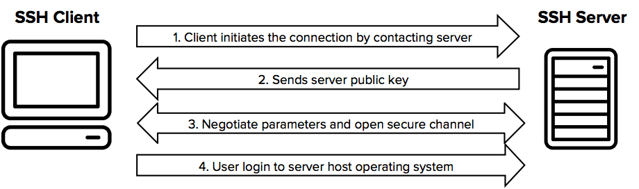
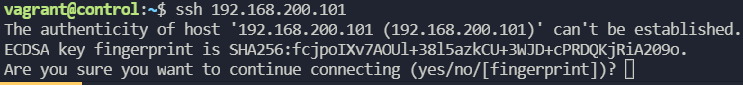
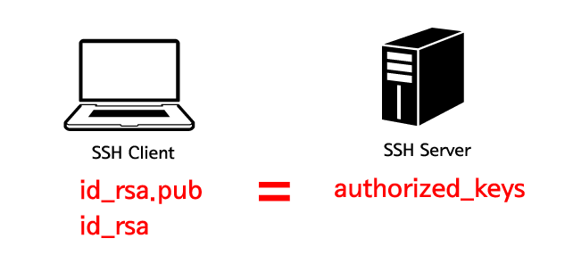

# SSH 및 sudo 관련 문제
   

## 1. 사용자를 지정하지않고 로그인할 경우 어떤 사용자로 로그인되는가?   
사용자를 지정하지 않는다는 것은 ssh 192.168.200.100 # 이런식으로 접속할 때...
아마 root?라는 이야기는 틀림   
지금 시스템을 사용하고있는 지금 로그인된 사용자로 로그인 된다.   

일반적으로는 사용자 계정을 지정해준다.   

   

위 사진처럼 ssh 접속을 시도할 때 SHA256 값은 **서버**의 공개키 지문에 해당하는 해시값이다.
## 2. ssh keypair 생성 방법
SSH 클라이언트에서 ssh-keygen 명령어로 생성   

키를 생성하면 공개키와 비공개키가 생성된다.   

비공개키는 로컬(client)에 공개키는 server에 위치하면 된다.    

**ssh-copy-id** 명령어를 통해 원격접속을 원하는 서버에 공개키를 전송할 수 있다.   

```
ssh-copy-id root@192.168.200.52 # 로컬혹은 클라이언트에서 원격서버로 공개키를 전송

ssh-keygen -t rsa # rsa와 같이 암호화방식을 지정해줄 수 있다.

ssh-keygen # 기본명령어로 생성도 가능하다 default가 rsa 방식의 암호화
```
키페어는 ~/.ssh/ 디렉토리밑에 생성이된다.   

|id_rsa|private key, 비공개키|
|------|--------------------|
|id_rsa.pub| public key, 공개 키 ,접속하려는 SSH Server의 authorized_keys에 입력한다.|
|authorized_keys|연결하려는 SSH Server의 .ssh 디렉토리 아래에 위치하면서 id_rsa.pub 키의 값을 저장한다. |

## 3. ~/.ssh/known_hosts 파일
Client 의 관점에서    
처음으로 ssh 접속을 진행하게되면, connecting 하겠냐고 물어본다. yes 입력하면 ~/.ssh/known_hosts 파일에 rsa key 정보가 등록되면서, 다음에 접속시에 다시 물어보지 않는다. 

## 4. ~/.authorized_keys 파일
Server의 관점에서   
client가 ssh-keygen 을 이용하여 비공개키, 공개키를 생성하고
ssh-copy-id 명령어를 통해 공개키를 서버로 보냈을 것이다.
보낸 공개키가 저장되는 파일이 authorized_keys 파일이다.      

   

원격접속을 시도할 때 로컬(혹은 클라이언트) 의 비공개키와 authorized_keys 파일을 비교하여 접속한다. 


## 5. sudo 명령어를 사용할 수 있는 사용자는?
redhat 계열의 OS: 보조그룹에 wheel 이 있는 사용자는 sudo 권한을 사용할 수 있다.    

/etc/sudoers 파일에 아래와같은 형식으로 추가하여 권한을 부여할 수도 있다

```
# User privilege specification
root    ALL=(ALL:ALL) ALL

# Members of the admin group may gain root privileges
%admin  ALL=(ALL) ALL

# Allow members of group sudo to execute any command
%sudo   ALL=(ALL:ALL) ALL
```

visudo 이용하면 syntax check 를 해준다.
/etc/sudoers 뿐만 아니라 /etc/sudoers.d 에도 sudo 권한에 대한설정이 존재한다.    

root ALL1=(ALL2) ALL3  # ALL:ALL 은 그냥 ALL이랑 같은 의미   
ALL 1 : Host, ALL 2 : user, ALL 3: command    

유저이름 호스트=(유저) 커맨드 의 형식으로 작성
                
## 6. Passwordless Sudo 설정 방법?
/etc/sudoers 파일에 맨 아래쪽에 아래와 같은 형식으로 내용을 추가하여준다.   

```
[username] ALL=NOPASSWD: ALL
```
user의 이름은 user01로 가정   
ex) user01 ALL=NOPASSWD: ALL # 와 같이 내용추가   
```
testuser1 ALL=NOPASSWD: /usr/sbin/useradd, /usr/sbin/userdel #특정 명령어에만 sudo를 패스워드없이 사용할 수도 있다.
```
## 7. ssh key passphrase를 매번 입력하지 않고 사용하는 방법은?
~~/etc/ssh/sshd_config 파일을 수정하여준다.   
PasswordAuthentication 부분을 찾아서 no로 설정을 바꿔준다.    
만약 no로 설정하였다면 ssh-keygen 또한 실행이 안되므로 다시 yes로 바꿔주고 진행한다~~~   
다 틀림
```
ssh-agent bash # bash 쉘을 ssh-agent 로 사용하겠다
ssh-add ~/.ssh/id_rsa # 명령어통해 passphrase 안물어보게 할 수 있다
```
