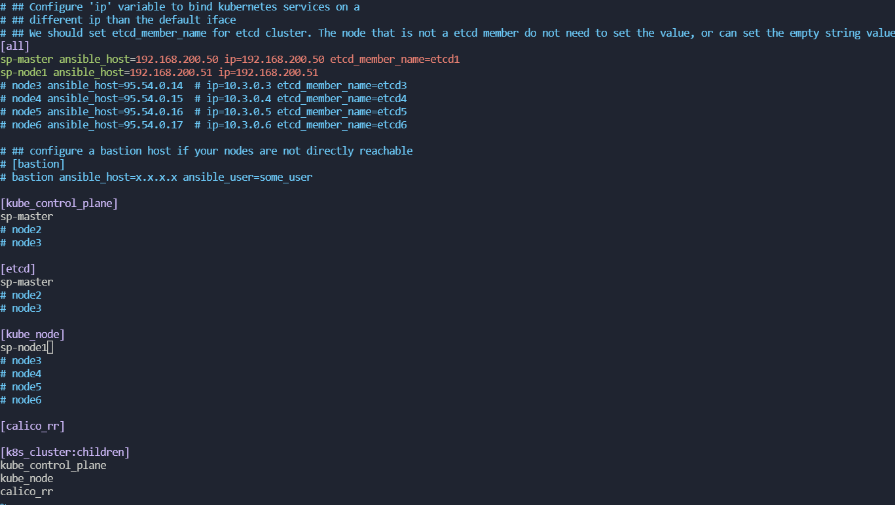
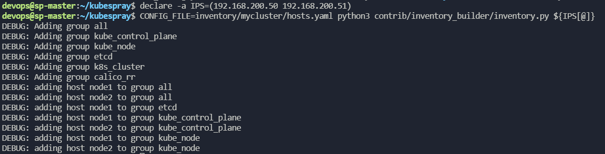
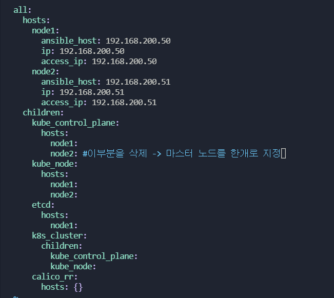
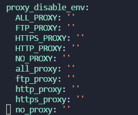

[공식 문서](https://github.com/kubernetes-sigs/kubespray)   &
[참조 블로그](https://lindarex.github.io/kubernetes/ubuntu-kubernetes-installation-with-kubespray/)   &
[kubespray.io](https://kubespray.io/#/)    
가상머신 2개        
sp-master 192.168.200.50     
sp-node1 192.168.200.51       

user는 두 노드 모두 devops/devops 로 구성   


기본적인 ssh 키기반 인증 구성       
``` bash
ssh-keygen
vi /etc/ssh/sshd_config
passwordauthentication yes 바꿔주고
sudo systemctl restart ssh # 이거 중요함
ssh-copy-id devops@192.168.200.51 # master에서
ssh-copy-id devops@192.168.200.50 # 자기자신한테도 키를 보내놔야함!!!
sudo vi /etc/sudoers # devops에 sudo 권한 두 노드 다 부여하기
```
```bash
git clone https://github.com/kubernetes-sigs/kubespray.git
cd kubesparay
```
```bash
sudo apt install -y python3-pip # ansible이 python기반이므로 패키지설치도 pip 진행이 많음
```
```bash
sudo pip3 install -t requirements.txt # ansible, jinja2 등등 설치
cp -rfp inventory/sample inventory/mycluster

vi ~/kubespray/inventory/mycluster/inventory.ini
```
           

```bash
declare -a IPS=(192.168.200.50 192.168.200.51)
CONFIG_FILE=inventory/mycluster/hosts.yaml python3 contrib/inventory_builder/inventory.py ${IPS[@]}
```
     

```
vi inventory/mycluster/hosts.yaml # 기본적으로 노드들 모두 마스터에 올리는데 그것을 한개만 컨트롤플레인에 등록되도록 변경
```
          


```bash
ansible-playbook -i inventory/mycluster/hosts.yaml  --become --become-user=root cluster.yml # ansible-playbook 통해서 kubernetes 설치
```
[node 추가 wtih kubespray link](https://taco-docs.readthedocs.io/ko/latest/operation/scale-out.html)

---
## cluster.yml 파일 분석
import playbook : ansible_version.yml, legacy_groups.yml, facts.yml        

변수는 group_vars 디렉토리 밑의 파일들을 참고하게끔 되어있다. 
* cluster.yml 파일   
사용되는 모듈: environment, roles, any_errors_fatal, startegy, 

* ansible_version.yml 파일   
사용되는 모듈: assert, tags       
ansible의 버전 호환성을 확인, python netaddr installed 확인, jinja 버전 확인       

* legacy_groups.yml 파일         
사용되는 모듈: group_by       
inventory에 작성한 마스터노드, 워커노드, all 그룹들을 재정렬? 한다. 

* facts.yml    
사용되는 모듈: setup    
팩트변수들을 수집한다. ansible_default_ipv4 와같은 시스템에대한 변수들을 cluster.yml 파일에서 사용하기위해 gathering 작업을 수행한다.         

~/kubespray/cluster.yml
```yaml
- name: Check ansible version 
  import_playbook: ansible_version.yml # assert 모듈통해서 버전확인 play

- name: Ensure compatibility with old groups
  import_playbook: legacy_groups.yml  # kube-master와 같이 예전어휘를 지금의 control plain과 같이 바꿔준다. 

- hosts: bastion[0] #배스쳔 호스트 설정은 하지 않았기 때문에 play 넘어갈것 같다. bastion 호스트는 노드에 직접접근하지 못하는 상황일 때 사용하는데 현재 실습환경은 vagrant 로 모두 직접접근 혹은 ssh로 모두 직접접근 가능하므로 설정하지 않았다. 
  gather_facts: False
  environment: "{{ proxy_disable_env }}"
  roles:
    - { role: kubespray-defaults }
    - { role: bastion-ssh-config, tags: ["localhost", "bastion"] }

- hosts: k8s_cluster:etcd
  strategy: linear
  any_errors_fatal: "{{ any_errors_fatal | default(true) }}"
  gather_facts: false
  environment: "{{ proxy_disable_env }}"
  roles:
    - { role: kubespray-defaults }
    - { role: bootstrap-os, tags: bootstrap-os}

- name: Gather facts
  tags: always
  import_playbook: facts.yml

- hosts: k8s_cluster:etcd
  gather_facts: False
  any_errors_fatal: "{{ any_errors_fatal | default(true) }}"
  environment: "{{ proxy_disable_env }}"
  roles:
    - { role: kubespray-defaults }
    - { role: kubernetes/preinstall, tags: preinstall }
    - { role: "container-engine", tags: "container-engine", when: deploy_container_engine|default(true) }
    - { role: download, tags: download, when: "not skip_downloads" }

- hosts: etcd
  gather_facts: False
  any_errors_fatal: "{{ any_errors_fatal | default(true) }}"
  environment: "{{ proxy_disable_env }}"
  roles:
    - { role: kubespray-defaults }
    - role: etcd
      tags: etcd
      vars:
        etcd_cluster_setup: true
        etcd_events_cluster_setup: "{{ etcd_events_cluster_enabled }}"
      when: not etcd_kubeadm_enabled| default(false)

- hosts: k8s_cluster
  gather_facts: False
  any_errors_fatal: "{{ any_errors_fatal | default(true) }}"
  environment: "{{ proxy_disable_env }}"
  roles:
    - { role: kubespray-defaults }
    - role: etcd
      tags: etcd
      vars:
        etcd_cluster_setup: false
        etcd_events_cluster_setup: false
      when: not etcd_kubeadm_enabled| default(false)

- hosts: k8s_cluster
  gather_facts: False
  any_errors_fatal: "{{ any_errors_fatal | default(true) }}"
  environment: "{{ proxy_disable_env }}"
  roles:
    - { role: kubespray-defaults }
    - { role: kubernetes/node, tags: node }

- hosts: kube_control_plane
  gather_facts: False
  any_errors_fatal: "{{ any_errors_fatal | default(true) }}"
  environment: "{{ proxy_disable_env }}"
  roles:
    - { role: kubespray-defaults }
    - { role: kubernetes/control-plane, tags: master }
    - { role: kubernetes/client, tags: client }
    - { role: kubernetes-apps/cluster_roles, tags: cluster-roles }

- hosts: k8s_cluster
  gather_facts: False
  any_errors_fatal: "{{ any_errors_fatal | default(true) }}"
  environment: "{{ proxy_disable_env }}"
  roles:
   - { role: kubespray-defaults }
    - { role: kubernetes/kubeadm, tags: kubeadm}
    - { role: kubernetes/node-label, tags: node-label }
    - { role: network_plugin, tags: network }

- hosts: calico_rr
  gather_facts: False
  any_errors_fatal: "{{ any_errors_fatal | default(true) }}"
  environment: "{{ proxy_disable_env }}"
  roles:
    - { role: kubespray-defaults }
    - { role: network_plugin/calico/rr, tags: ['network', 'calico_rr'] }

- hosts: kube_control_plane[0]
  gather_facts: False
  any_errors_fatal: "{{ any_errors_fatal | default(true) }}"
  environment: "{{ proxy_disable_env }}"
  roles:
    - { role: kubespray-defaults }
    - { role: win_nodes/kubernetes_patch, tags: ["master", "win_nodes"] }

- hosts: kube_control_plane
  gather_facts: False
  any_errors_fatal: "{{ any_errors_fatal | default(true) }}"
  environment: "{{ proxy_disable_env }}"
  roles:
    - { role: kubespray-defaults }
    - { role: kubernetes-apps/external_cloud_controller, tags: external-cloud-controller }
    - { role: kubernetes-apps/network_plugin, tags: network }
    - { role: kubernetes-apps/policy_controller, tags: policy-controller }
    - { role: kubernetes-apps/ingress_controller, tags: ingress-controller }
    - { role: kubernetes-apps/external_provisioner, tags: external-provisioner }
    - { role: kubernetes-apps, tags: apps }

- hosts: k8s_cluster
  gather_facts: False
  any_errors_fatal: "{{ any_errors_fatal | default(true) }}"
  environment: "{{ proxy_disable_env }}"
  roles:
    - { role: kubespray-defaults }
    - { role: kubernetes/preinstall, when: "dns_mode != 'none' and resolvconf_mode == 'host_resolvconf'", tags: resolvconf, dns_late: true }
```

~/kubespray/roles/kubespray-defaults/defaults/main.yaml    
파일에서 정의한 내용이 cluster.yaml의 environment로 들어간다.    
      

```
vi ~/kubespray/roles/kubespray-defaults/defaults/main.yaml # cluster.yml 에 들어가는 변수 proxy_disable_env가 있고 이 파일은 role 파일? 이다.
```

roles 디렉토리에 있는 작업들을 지정하여 cluster.yml 파일에서 play에 넣어주는것 같다.      
roles 디렉토리의 task 디렉토리 밑의 작업들이 수행되는 것     
```bash
ansible-galaxy init {이름}

$ tree .
.
├── README.md
├── defaults
│   └── main.yml
├── files
├── handlers
│   └── main.yml
├── meta
│   └── main.yml
├── tasks
│   └── main.yml
├── templates
├── tests
│   ├── inventory
│   └── test.yml
└── vars
    └── main.yml
```
위와같이 Role 생성시 자동으로 생성됨
* Role의 구성요소
1. defaults : 각 task에서 사용할 기본값 설정
2. files : 정적파일을 두는 곳 , task에서 files로부터 파일을 끌어사용가능
3. handlers : task에서 사용할 handler 위치
4. meta : role의 메타정보 위치, 의존성 정보들이 기입되어있어야한다. 
5. **task** : role의 핵심폴더, role이 실제로 동작할 내용포함
6. templates : jinja2 템플릿 변수들 
7. vars : role에서 사용할 변수들 목록        


다른 버전의 kubespray 설치
```
git clone -b release-2.15 https://github.com/kubernetes-sigs/kubespray.git
```